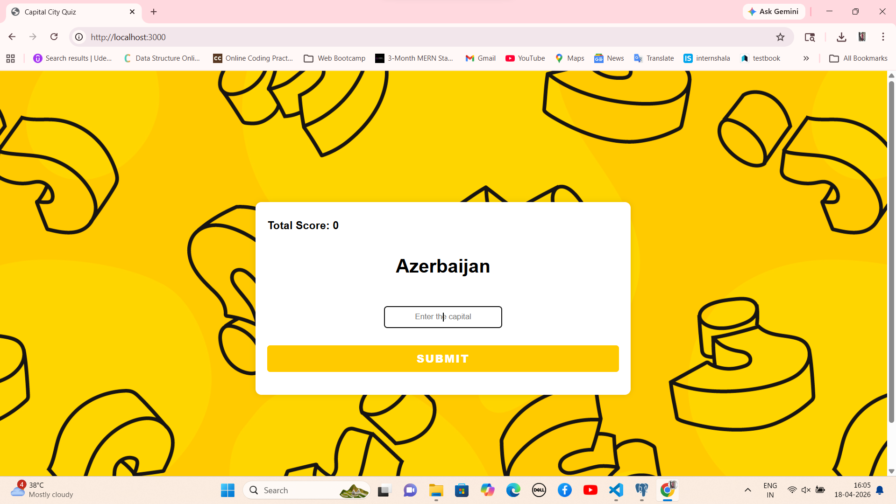
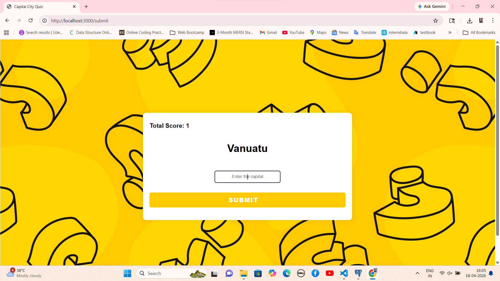
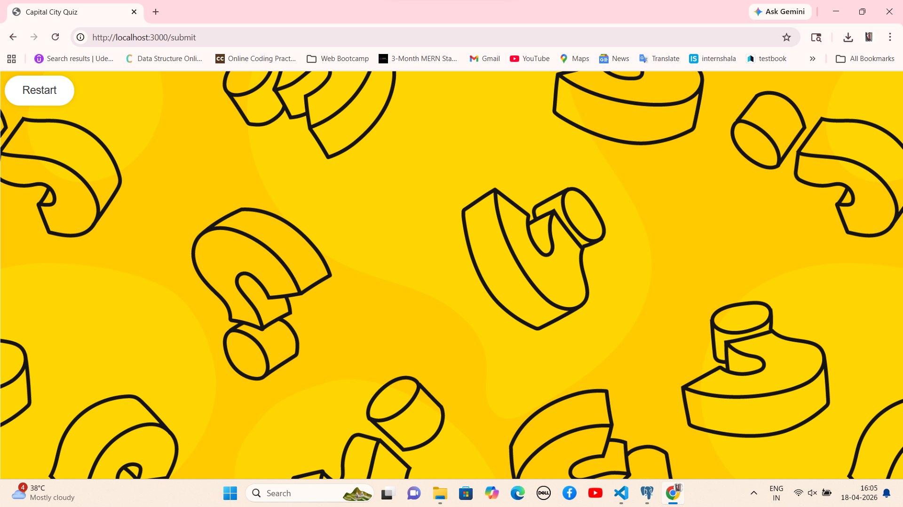

# 🌍 World Capital Quiz


An interactive **web-based quiz application** that tests your knowledge of world capitals.
Built using **Node.js, Express, PostgreSQL, and EJS**, this project dynamically fetches data from a database and provides a fun learning experience.

---

## 🎯 Purpose of This Project

This project was created to:

* Learn **Node.js and Express**
* Practice **PostgreSQL integration**
* Understand backend data fetching
* Connect frontend (EJS) with backend logic
* Handle form submission and validation

📘 Inspired by:
**Angela Yu – The Complete Full-Stack Web Development Bootcamp (Udemy)**

---

## 🚀 Features

* 🌍 Random country questions
* ✍️ User input for answers
* 📈 Score tracking
* ❌ Game over on wrong answer
* 🔄 Restart quiz option
* ⚡ Dynamic database-driven questions

---

## 🛠️ Tech Stack

| Technology | Usage             |
| ---------- | ----------------- |
| Node.js    | Backend runtime   |
| Express.js | Server framework  |
| PostgreSQL | Database          |
| EJS        | Templating engine |
| HTML/CSS   | Frontend UI       |

---

## 📂 Project Structure

```
World-Capital-Quiz/
│── node_modules/
│── public/
│   ├── images/
│   │   └── background.jpg
│   ├── styles/
│   │   └── main.css
│── views/
│   └── index.ejs
│── capitals.csv (optional)
│── index.js
│── package.json
│── package-lock.json
│── README.md
│── .gitignore
```

---

## ⚙️ Installation & Setup

### 1️⃣ Clone Repository

```bash
git clone https://github.com/your-username/world-capital-quiz.git
```

### 2️⃣ Navigate to Folder

```bash
cd world-capital-quiz
```

### 3️⃣ Install Dependencies

```bash
npm install

npm install -g nodemon
```
npm install express body-parser pg ejs
---

## 🗄️ Database Setup (PostgreSQL)

### Create Database

```sql
CREATE DATABASE country;
```

### Create Table

```sql
CREATE TABLE capitals (
  id SERIAL PRIMARY KEY,
  country VARCHAR(100),
  capital VARCHAR(100)
);
```

### Insert Data

```sql
INSERT INTO capitals (country, capital) VALUES
('India', 'New Delhi'),
('France', 'Paris'),
('Germany', 'Berlin'),
('Japan', 'Tokyo'),
('Brazil', 'Brasilia');
```

---

## ▶️ Run the Project

```bash
nodemon index.js
```

OR

```bash
node index.js
```

🌐 Open in browser:

```
http://localhost:3000
```

---

## 🎮 How It Works

1. A random country is displayed
2. User enters the capital
3. ✅ Correct → Score increases
4. ❌ Wrong → Game ends
5. 🔄 Restart and play again

---

## 📸 Screenshots

### 🏠 Home Page



### ✅ Correct Answer



### ❌ Game Over



---

## 🎥 Demo (Optional but 🔥)

👉 You can add a GIF here for better visibility
(Use tools like ScreenToGif)

```

```

---

## 📸 Screenshots

### 🏠 Home Page


### ✅ Correct Answer


### ❌ Game Over


## 💡 Future Improvements

* 🔘 Multiple choice questions
* 🏆 Leaderboard
* ⏱️ Timer
* 🎚️ Difficulty levels
* 🌐 Deploy online

---

## 🙋‍♀️ Author

**Prarthana Bhandari**
🎓 MCA Student
💻 Backend Developer Learner


